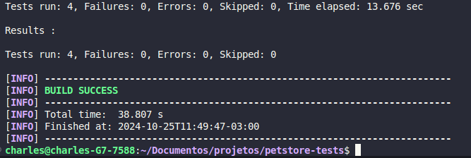
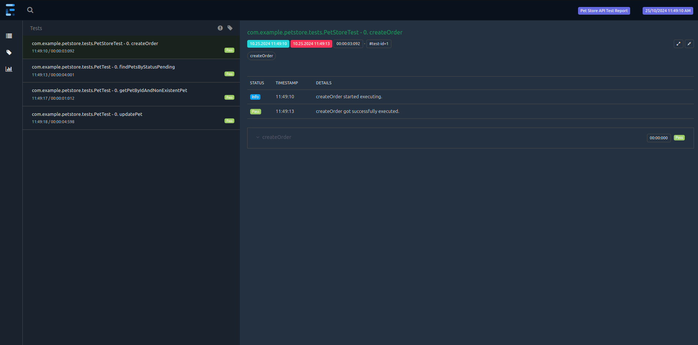
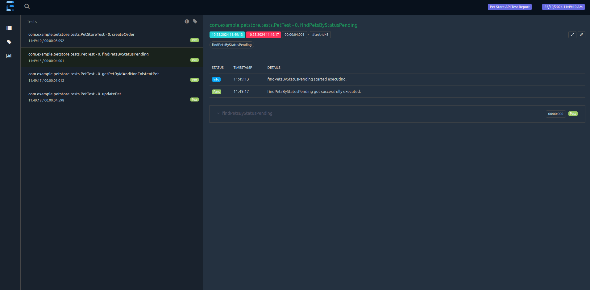
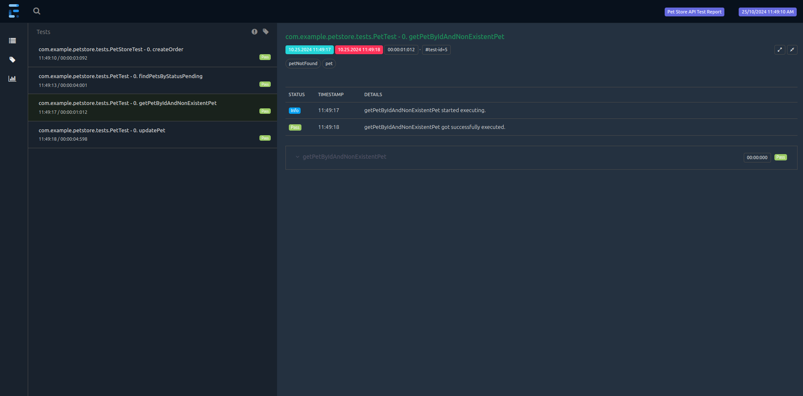
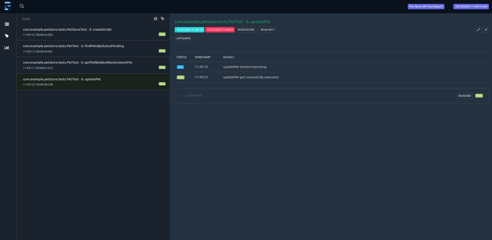
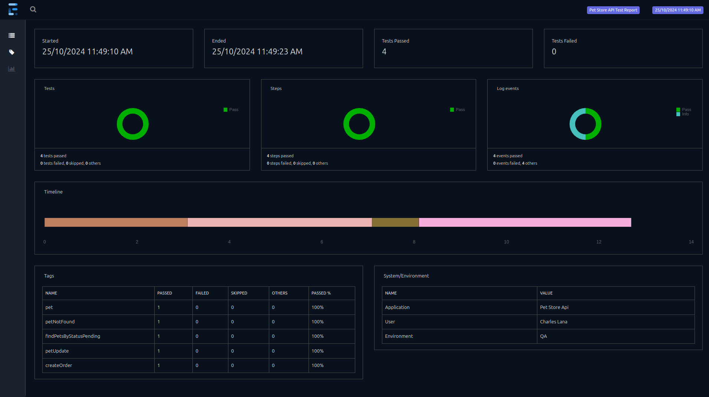

# Java+RestAssured

Requer Java 21

# Instalar dependências

Os testes serão executados em paralelo

```bash
mvn clean install
```

Os testes são pulados após instalação

```bash
mvn clean install -DskipTests
```

# Executar todos os testes

```bash
mvn test
```

# Executar teste em grupo

```bash
mvn test -Dgroups="createOrder"
```

# Executar teste pelo método da classe de teste

```bash
mvn test -Dtest=PetTest#updatePet
```

# Executar testes pelo testng.xml

```bash
mvn test -DsuiteXmlFile=testng.xml
```

# Relatórios

### Execução dos testes



### Cadastrar novo pedido de pet com sucesso (POST /store/order)



### Pesquisar por pets com status “pending” (GET /pet/findByStatus)



### Pesquisar por um pet inexistente (GET /pet/{petId})



### Atualizar dados de um pet existente (PUT /pet)



### Todos os testes



# Processo para criar o projeto

## Sistema operacional utilizado

Linux

## Instalação do java 21

```bash
sudo apt install openjdk-21-jdk
```

## Ferramenta IDE

VSCode

## Configurar JDK para o VSCode

Ctrl + Shift + P e configurar o arquivo de configuração do usuário pela busca "settings.json"

```bash
{
    "java.jdt.ls.java.home": "/usr/lib/jvm/java-21-openjdk-amd64",
    "java.configuration.runtimes": [
        {
            "name": "JavaSE-21",
            "path": "/usr/lib/jvm/java-21-openjdk-amd64",
            "default": true
        }
    ]
}
```

## Maven , gerenciador de pacotes

```bash
sudo apt install maven
```

## Projeto criado a partir do comando

```bash
mvn archetype:generate -DgroupId=com.example.petstore -DartifactId=petstore-tests -DarchetypeArtifactId=maven-archetype-quickstart -DinteractiveMode=false
```
